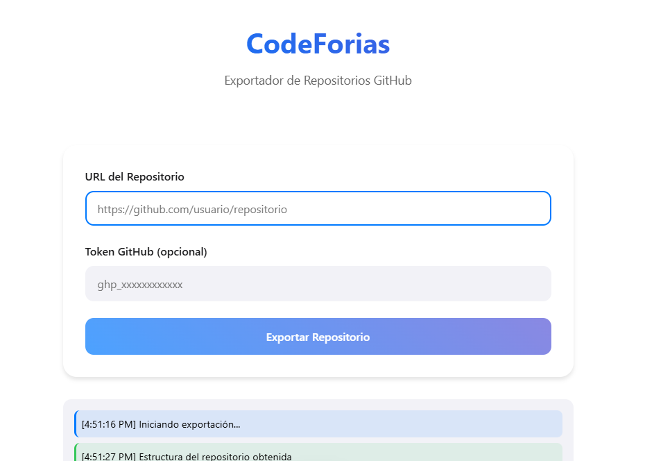

# CodeForias 🚀

CodeForias es una herramienta web que facilita la exportación de repositorios de GitHub a archivos de texto, optimizada especialmente para trabajar con Large Language Models (LLMs) y herramientas de IA.



## 🎯 Objetivo

El principal objetivo de CodeForias es simplificar la interacción entre desarrolladores y herramientas de IA, resolviendo el tedioso proceso de copiar y pegar múltiples archivos cuando necesitas analizar código con LLMs.

## ✨ Características

- **Exportación Simple**: Convierte repositorios completos a un único archivo de texto organizado
- **Formato Optimizado**: Estructura clara y ordenada para mejor interpretación por IAs
- **Interfaz Intuitiva**: Diseño limpio inspirado en interfaces modernas
- **Soporte para Tokens**: Compatible con repositorios privados mediante token de GitHub
- **Procesamiento Eficiente**: Manejo optimizado de repositorios grandes

## 🚀 Demo

Prueba CodeForias en vivo: [https://codeforias.vercel.app](https://codeforias.vercel.app)

## 🛠️ Tecnologías Utilizadas

- Frontend:
  - HTML/CSS/JavaScript
  - Diseño responsivo
  - Estilo inspirado en interfaces modernas

- Backend:
  - Node.js
  - GitHub API (Octokit)
  - Vercel Serverless Functions

- Despliegue:
  - Vercel

## 📝 Uso

1. Visita [CodeForias](https://codeforias.vercel.app)
2. Ingresa la URL del repositorio que deseas exportar
3. (Opcional) Agrega tu token de GitHub para repositorios privados
4. Haz clic en "Exportar Repositorio"
5. Descarga el archivo de texto generado
6. ¡Listo para usar con tu LLM favorito!

## 🔑 Token de GitHub

Para generar un token de GitHub:

1. Ve a [GitHub Settings](https://github.com/settings/tokens)
2. Click en "Generate new token"
3. Selecciona los siguientes permisos:
   - `repo` (acceso completo a repositorios)
   - `read:org` (opcional, para repos de organizaciones)

## 💻 Configuración Local

```bash
# Clonar repositorio
git clone https://github.com/lumigamher/codeforias.git

# Instalar dependencias
cd codeforias
npm install

# Variables de entorno
cp .env.example .env
# Configura tus variables en .env

# Iniciar desarrollo
npm run dev
```

## 🌐 Despliegue

CodeForias está optimizado para desplegarse en Vercel:

```bash
# Instalar Vercel CLI
npm i -g vercel

# Desplegar
vercel
```

## 📄 Estructura del Proyecto

```
codeforias/
├── frontend/
│   └── index.html
├── api/
│   └── export.js
├── vercel.json
└── package.json
```

## 🤝 Contribuir

1. Fork del repositorio
2. Crea una rama para tu feature
   ```bash
   git checkout -b feature/AmazingFeature
   ```
3. Commit tus cambios
   ```bash
   git commit -m 'Add: Amazing Feature'
   ```
4. Push a la rama
   ```bash
   git push origin feature/AmazingFeature
   ```
5. Abre un Pull Request

## 📝 Limitaciones Conocidas

- Archivos mayores a 500KB son omitidos para evitar timeouts
- Repositorios muy grandes pueden requerir múltiples intentos
- El tiempo de procesamiento depende del tamaño del repositorio

## 🐛 Reporte de Problemas

Si encuentras algún problema o tienes sugerencias, por favor abre un issue:
1. Usa el template proporcionado
2. Incluye los pasos para reproducir el error
3. Adjunta capturas de pantalla si es posible

## 📜 Licencia

Distribuido bajo la Licencia MIT. Ver `LICENSE` para más información.

## 📧 Contacto

Luis Miguel Gamboa - [@MiguelHern69701](https://twitter.com/MiguelHern69701)

Link del Proyecto: [https://github.com/lumigamhero/codeforias](https://github.com/lumigamher/codeforias)

---

⭐️ Si este proyecto te fue útil, considera darle una estrella!